This repository documents an integrated pipeline for building and refining an exhaustive historical newspaper corpus using a combination of LLMs and more conventional NLP methods. It is centered on the topic of returned students in the Chinese (*Shenbao*) and English-language ([ProQuest Chinese Newspapers Collection](https://stage-about.proquest.com/en/products-services/hnp_cnc/)) presses, but we believe the pipeline is adaptable to other research queries.

The repository structure follows the steps of the pipeline (see linked SVG):

1. **Initial query** using [HistText](https://bookdown.enpchina.eu/HistText_Book/)
2. **Query expansion** using enp-china embeddings
3. **Optical Character Recognition (OCR) quality** assessment using [Impresso pipelines](https://github.com/impresso/impresso-pipelines)
4. **Relevance classification** using LLMs, with two options: OpenAI API or Ollama (local)
5. **Article segmentation** using LLMs, with three options: OpenAI API, Codex, or Ollama (local).

Pipeline 

